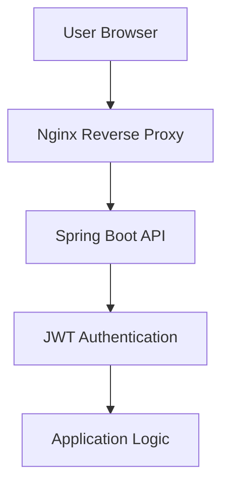

# **Kutukalan Portfolio Website**


[🇬🇧 English](#-english) | [🇹🇷 Türkçe](#-türkçe)

## **Project Preview**  


> Not: Ekran görüntüsünde yer alan bazı menü öğeleri yalnızca admin rolü için görünürdür.

> Note: Some menu items visible in the screenshot are only available for the admin role.

🌐 **Live:** https://kutukalan.com


## 🇹🇷 Türkçe
##  **Proje Hakkında** 
React, TypeScript ve TailwindCSS kullanılarak geliştirilmiş modern bir kişisel portföy web sitesidir.  
Proje Linux VPS üzerinde Spring Boot backend ve Nginx reverse proxy mimarisi ile yayınlanmaktadır.

Bu proje, projelerimi, müzik üretimlerimi ve kişisel bilgilerimi modern ve etkileşimli bir şekilde sergilemek amacıyla geliştirilmiş full-stack bir portföy platformudur.

Frontend kısmı React ve TypeScript kullanılarak geliştirilmiştir.  
Backend tarafında ise Spring Boot REST API mimarisi kullanılmaktadır.

Altyapı tarafında Linux VPS üzerinde çalışan bir yapı bulunmaktadır. Nginx, HTTPS, reverse proxy, güvenlik başlıkları ve rate limiting gibi işlemleri yönetmektedir.

## **Tech Stack**  

### Frontend
- React.js
- TypeScript
- TailwindCSS
- GSAP (animations)

### Backend
- Spring Boot
- REST API
- JWT Authentication

### Database
- MySQL
- Spring Data JPA
- Hibernate

### Infrastructure
- Linux VPS
- Nginx
- HTTPS (Let's Encrypt)
- Reverse Proxy

## Özellikler

- ⚡ React ve TypeScript ile geliştirilmiş modern frontend mimarisi
- 🎨 TailwindCSS ile responsive ve modern tasarım
- 🎬 GSAP ile akıcı ve etkileşimli animasyonlar
- 🔐 JWT tabanlı kimlik doğrulama sistemi
- 🛡️ Güvenlik başlıkları ve bot tarama koruması
- 🚀 Linux VPS üzerinde Nginx ile yayınlanmış production ortamı

### **İçerik ve Platform Özellikleri**  

- 📝 Blog yazıları ve proje içerikleri
- 💼 Projelerimi sergilediğim proje sayfaları
- 🎵 Müzik üretimlerim için müzik kütüphanesi ve müzik oynatıcı
- 👨‍💻 Kişisel tanıtım, deneyimler ve teknik yetkinlikler
- 📱 Mobil uygulama geliştirme süreçleri
- 🖥️ Masaüstü uygulama geliştirme süreçleri
- 🌐 Web sitesi projelerimin yer aldığı portföy alanı

## **Backend**  
Backend deposu güvenlik, sunucu yapılandırması ve ortam değişkenleri içerdiği için private tutulmaktadır.
Backend tarafında kullanılan yapı:

- Spring Boot REST API
- HttpOnly cookie ile JWT authentication
- Role tabanlı yetkilendirme
- Güvenli API endpointleri
- Ortam değişkenleri ile secret yönetimi

## **Project Structure** 
```
project-root
│
├── frontend
│   ├── context
│   ├── components
│   ├── pages
│   ├── services
│   ├── hooks
│   ├── utils
│   ├── constants
│   └── assets
│
└── backend (private)
    ├── entities
    ├── enums
    ├── repositories
    ├── controllers
    ├── services
    ├── responses
    ├── requests
    ├── config
    ├── security
    └── configuration
```

## **System Architecture**  



## **Güvenlik**  
Sunucu tarafında çeşitli production seviyesinde güvenlik önlemleri uygulanmıştır:

- HTTPS zorlaması (HSTS)
- Content Security Policy
- Permissions Policy
- X-Frame koruması
- Bot tarama koruması
- Login istekleri için rate limiting

## **Yayınlama**  
Uygulama Linux VPS üzerinde aşağıdaki yapı kullanılarak yayınlanmaktadır:

- Nginx reverse proxy
- Arka planda çalışan Spring Boot servisi
- Ortam değişkenleri ile secret yönetimi
- Let's Encrypt ile otomatik HTTPS

---
## 🇬🇧 English
## **About the Project** 
This is a modern personal portfolio website built using React, TypeScript, and TailwindCSS.
The project is deployed on a Linux VPS using a Spring Boot backend and Nginx reverse proxy architecture.

This project is a full-stack portfolio platform developed to showcase my projects, music productions, and personal information in a modern and interactive way.

The frontend is developed using React and TypeScript, while the backend is implemented with a Spring Boot REST API architecture.

The infrastructure runs on a Linux VPS environment, where Nginx handles HTTPS, reverse proxy operations, security headers, and rate limiting.

## **Tech Stack**  

### Frontend
- React.js
- TypeScript
- TailwindCSS
- GSAP (animations)

### Backend
- Spring Boot
- REST API
- JWT Authentication

### Database
- MySQL
- Spring Data JPA
- Hibernate

### Infrastructure
- Linux VPS
- Nginx
- HTTPS (Let's Encrypt)
- Reverse Proxy

##  **Features**  

* ⚡ Modern frontend architecture built with React and TypeScript
* 🎨 Responsive and modern UI using TailwindCSS
* 🎬 Smooth and interactive animations with GSAP
* 🔐 JWT-based authentication system
* 🛡️ Security headers and bot scanning protection
* 🚀 Production deployment on Linux VPS with Nginx

### **Platform & Content Features**  

- 📝 Blog posts and project content
- 💼 Dedicated project showcase pages
- 🎵 Music library and integrated music player for my productions
- 👨‍💻 Personal introduction, experience, and technical skills
- 📱 Mobile application development projects
- 🖥️ Desktop application development projects
- 🌐 Portfolio section containing my web development projects

## **Backend**  
The backend repository is kept private because it contains security configurations, server infrastructure details, and environment variables.
The backend includes the following architecture:

- Spring Boot REST API
- JWT authentication with HttpOnly cookies
- Role-based authorization
- Secure API endpoints
- Environment-based secret management

## **Project Structure** 
```
project-root
│
├── frontend
│   ├── context
│   ├── components
│   ├── pages
│   ├── services
│   ├── hooks
│   ├── utils
│   ├── constants
│   └── assets
│
└── backend (private)
    ├── entities
    ├── enums
    ├── repositories
    ├── controllers
    ├── services
    ├── responses
    ├── requests
    ├── config
    ├── security
    └── configuration
```

## **System Architecture**  


## **Security**  
Several production-level security measures are implemented on the server side:

* HTTPS enforcement (HSTS)
* Content Security Policy
* Permissions Policy
* X-Frame protection
* Bot scanning protection
* Login request rate limiting

## **Deployment**  
The application is deployed on a Linux VPS using the following setup:

- Nginx reverse proxy
- Spring Boot running as a background service
- Environment variable based secret management
- Automatic HTTPS with Let's Encrypt
