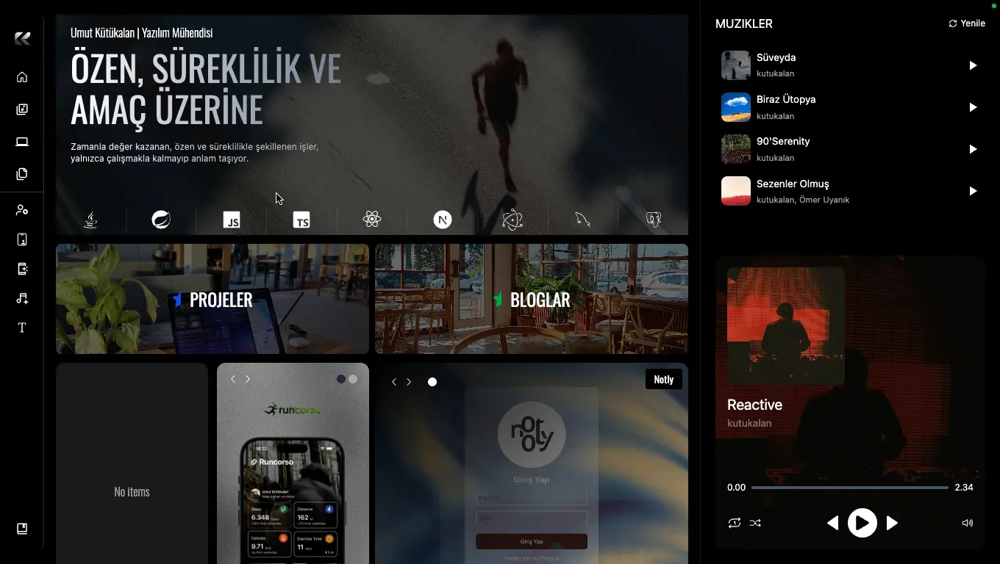
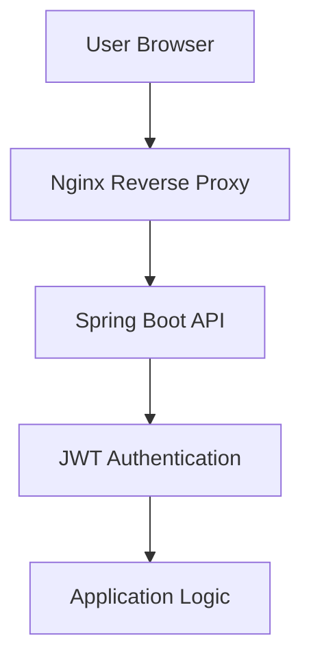

# **Kutukalan Portfolio Website** 

🌐 **Live:**  https://kutukalan.com

## **Proje Hakkında** | 🇹🇷 Türkçe
React, TypeScript ve TailwindCSS kullanılarak geliştirilmiş modern bir kişisel portföy web sitesidir.  
Proje Linux VPS üzerinde Spring Boot backend ve Nginx reverse proxy mimarisi ile yayınlanmaktadır.

Bu proje, projelerimi, müzik üretimlerimi ve kişisel bilgilerimi modern ve etkileşimli bir şekilde sergilemek amacıyla geliştirilmiş full-stack bir portföy platformudur.

Frontend kısmı React ve TypeScript kullanılarak geliştirilmiştir.  
Backend tarafında ise Spring Boot REST API mimarisi kullanılmaktadır.

Altyapı tarafında Linux VPS üzerinde çalışan bir yapı bulunmaktadır. Nginx, HTTPS, reverse proxy, güvenlik başlıkları ve rate limiting gibi işlemleri yönetmektedir.

## **Tech Stack**  

### Frontend
- React.js
- TypeScript
- TailwindCSS
- GSAP (animations)

### Backend
- Spring Boot
- REST API
- JWT Authentication

### Infrastructure
- Linux VPS
- Nginx
- HTTPS (Let's Encrypt)
- Reverse Proxy

## Özellikler

- ⚡ React ve TypeScript ile geliştirilmiş modern frontend mimarisi
- 🎨 TailwindCSS ile responsive ve modern tasarım
- 🎬 GSAP ile akıcı ve etkileşimli animasyonlar
- 🔐 JWT tabanlı kimlik doğrulama sistemi
- 🛡️ Güvenlik başlıkları ve bot tarama koruması
- 🚀 Linux VPS üzerinde Nginx ile yayınlanmış production ortamı

### **İçerik ve Platform Özellikleri**  

- 📝 Blog yazıları ve proje içerikleri
- 💼 Projelerimi sergilediğim proje sayfaları
- 🎵 Müzik üretimlerim için müzik kütüphanesi ve müzik oynatıcı
- 👨‍💻 Kişisel tanıtım, deneyimler ve teknik yetkinlikler
- 📱 Mobil uygulama geliştirme süreçleri
- 🖥️ Masaüstü uygulama geliştirme süreçleri
- 🌐 Web sitesi projelerimin yer aldığı portföy alanı

## **Backend**  
Backend deposu güvenlik, sunucu yapılandırması ve ortam değişkenleri içerdiği için private tutulmaktadır.
Backend tarafında kullanılan yapı:

- Spring Boot REST API
- HttpOnly cookie ile JWT authentication
- Role tabanlı yetkilendirme
- Güvenli API endpointleri
- Ortam değişkenleri ile secret yönetimi

## **Project Structure** 

frontend
 ├─ context
 ├─ components
 ├─ pages
 ├─ services
 ├─ hooks
 ├─ utils
 ├─ constants
 └─ assets

backend 
 ├─ entities
 ├─ enums
 ├─ repositories
 ├─ controllers
 ├─ services
 ├─ responses
 ├─ requests
 ├─ config
 ├─ security
 └─ configuration

## System Architecture

## **Güvenlik**  
Sunucu tarafında çeşitli production seviyesinde güvenlik önlemleri uygulanmıştır:

- HTTPS zorlaması (HSTS)
- Content Security Policy
- Permissions Policy
- X-Frame koruması
- Bot tarama koruması
- Login istekleri için rate limiting

## **Yayınlama**  
Uygulama Linux VPS üzerinde aşağıdaki yapı kullanılarak yayınlanmaktadır:

- Nginx reverse proxy
- Arka planda çalışan Spring Boot servisi
- Ortam değişkenleri ile secret yönetimi
- Let's Encrypt ile otomatik HTTPS